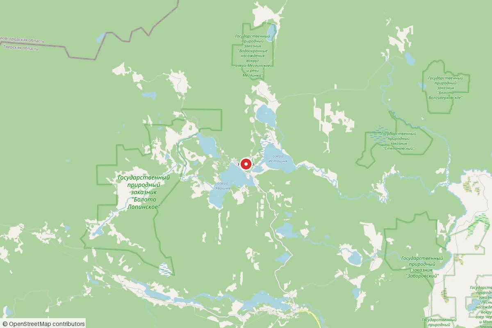
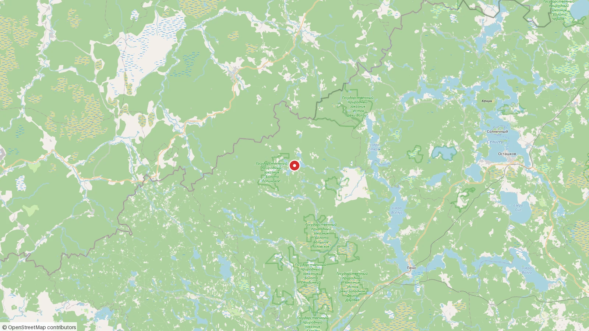

# Ферма «Рунская» — план развития хозяйства

**От идеи до самофинансируемого агрокомплекса, который кормит свою команду, продаёт продукцию в Москву и Петербург и реинвестирует прибыль в рост.**

Версия 3.1 · 2026-10-01 · составлен под фактические параметры хозяйства (раздел 1), обогащён по результатам аудита ([docs/AUDIT-2026-10.md](AUDIT-2026-10.md))

| Версия | Что изменилось |
|---|---|
| 1.0 | Первая версия: общая стратегия, 5 этапов |
| 2.0 | Пересчёт под фактические параметры: 1500 га, стафф-хаус 300 м² |
| 3.0 | Аудит и обогащение: **система целей (SMART)**, рынок и позиционирование, агрономическая политика, логистика рейсов, мотивация и обучение команды, налоги и сценарии, развитие собственника, цифровой контур, помесячный план года 1 |
| 3.1 | **Финансовая модель пересчитана под реальный стартовый капитал 2–4 млн ₽** (вместо ошибочно принятых 10 млн): bootstrap-путь «от выручки», дом строится очередями, первый найм 2–3 чел, безубыточность 30–42 мес; добавлен **каталог господдержки с проверенными ссылками (раздел 21)** — с 01.01.2026 «Агростартап» объединён в единый грант на развитие фермерского хозяйства |

Все суммы — ориентировочные диапазоны для Тверской области на 2026 год; открытые вопросы — раздел 20.

> **Ключевой тезис:** узкое место проекта — не земля (1500 га — избыток на годы вперёд) и не спрос (потребители в двух столицах уже есть). Узкое место — люди, фокус и дисциплина целей. План построен так: небольшая команда осваивает ядро территории, дом растёт вместе с командой, площадь в обороте увеличивается только вслед за людьми и техникой — и всё это сверяется с системой целей (раздел 3).

---

## 0. Резюме (TL;DR)

- **Актив:** 1500 га земель сельхозназначения, усадьба с жилым домом (2–3 чел), курятник, огород, пасека на 30 ульев, колодец, 15 кВт с расширением, бесплатный пиломатериал.
- **Бюджет:** 2–4 млн ₽ собственных средств + выручка уже работающих линий (мёд, яйцо, картофель) — **ферма строит себя сама**: выручка года становится бюджетом следующего; единый грант Минсельхоза (бывш. «Агростартап», раздел 21) — ускоритель на технику и хранилище, не фундамент.
- **Команда:** с нуля; первый найм — 2–3 человека (бригадир + универсалы; кухню закрывают дежурства и местная помощница на полдня), переходное жильё — существующий дом + бытовки.
- **Стафф-хаус 300 м²** из бесплатного пиломатериала — очередями: бытовки (год 1) → первое крыло 100–120 м² в тепле к концу года 2 (1,5–2,2 млн ₽ суммарно) → полные 300 м² к году 5–6 на заработанное; гостевая часть агротуризма — после.
- **Быстрые деньги года 1:** пасека (30 ульев = 0,6–1,2 млн ₽/год уже сейчас), яйцо, картофель 2–3 га, птенцы — на существующих потребителей в Москве и Петербурге. Эта выручка — главный источник стройки следующих очередей.
- **Безубыточность:** к 30–42 мес. К году 5 — выручка 11–16 млн ₽/год, прибыль 2–3,5 млн ₽/год; личный доход владельца на уровне 10 млн ₽/год — реалистично на году 7–9.
- **Обязательный блок:** 1500 га нельзя держать «про запас» — с 2025 г. действует требование освоения с/х земель (303-ФЗ): штрафы, налог ×10, риск изъятия. Ежегодная программа прокоса и поэтапного ввода в оборот — раздел 7.3.
- **Дисциплина:** 5 стратегических целей, SMART-план года 1, опережающие метрики и месячная одностраничная отчётность — раздел 3.

---

## 1. Исходные условия (фактические, подтверждены владельцем 2026-10-01)

| Актив | Параметры | Значение для плана |
|---|---|---|
| Земля | **1500 га**, земли сельхозназначения; межевание проведено | Главный актив; требует программы освоения (303-ФЗ); потенциал: поля, сенокосы, пастбища, медоносная база |
| Жилой дом | на 2–3 человека | База для владельца и первых сотрудников на время стройки |
| Стафф-хаус | **300 м², пиломатериал бесплатный**, готовы строить сами | Вместимость 15–20 чел — общежитие + будущая гостевая часть |
| Птицеводство | курятник есть | Самообеспечение яйцом/мясом с 1-го дня; птенцы — маржинальная линия |
| Огород | есть | Самообеспечение овощами; масштабировать |
| Пасека | **30 ульев** | Готовый коммерческий продукт: 600–900 кг мёда/год |
| Вода | колодец | Для питья/быта; для полива полей — уточнить (раздел 20) |
| Электричество | **15 кВт, расширение возможно** | Достаточно для дома и мастерской; цеха — расширение |
| Бюджет | **2–4 млн ₽ на первый год** + выручка действующих линий | Распределение — раздел 13 |
| Потребители | **Москва и Петербург — уже покупают** мёд, мясо птицы, картофель | Канал существует — оформлять и расширять (раздел 4) |
| Команда | никого, найм с нуля | Первый найм — этап 7.2; подробно — раздел 12 |

**Контекст региона (Пеновский округ, верхняя Волга):** безморозный период ~115–125 дней (заморозки до конца мая и с середины сентября), рядом Селигер с летним турпотоком, лес и болота — ягоды, грибы, липа, иван-чай. Расстояния: Тверь ~250 км, Москва ~420 км, Петербург ~450 км — оба столичных рынка достижимы фургоном.

**Где это на карте:** посёлок Рунский — северо-запад Пеновского округа, ~35 км северо-западнее райцентра Пено, у границы с Новгородской областью. Округ — 2385 км², из них ~77% лесов; вокруг — верхневолжские озёра (Вселук, Волго) и исток Западной Двины; до Осташкова на Селигере ~50 км по прямой.





*Карты: © участники [OpenStreetMap](https://www.openstreetmap.org/copyright). Отметка фермы — по адресу пос. Рунский (Nominatim), положение приблизительное.*

---

## 2. Видение и целевое состояние

**Миссия:** натуральное хозяйство в верховьях Волги — 1500 га земли, которые кормят живущих на них людей и оба столичных города без химии.

**Целевое состояние через 5 лет:**

- Команда 12–16 человек живёт на ферме (стафф-хаус 300 м² — полный к году 5–6 — + бытовки и домики).
- В обороте 100–150 га пашни, сенокосы и пастбища 200+ га, вся территория обслуживается (303-ФЗ выполнен).
- Линии: мёд (100–150 ульев), картофель 20–30 га, зерно кормовое 40–60 га, яйцо и птица (500+ кур, инкубатор), овцы/мясной скот на своих кормах, переработка, дары леса, агротуризм.
- Выручка 11–16 млн ₽/год к году 5 и 14–20 млн ₽/год к году 6–7; маржа 25–35%, 60–70% прибыли реинвестируется.
- Постоянная клиентская база в Москве и Петербурге: 150+ подписных семей, оптовые партнёры, фермерские точки.

**Чего план сознательно НЕ делает:** не осваивает 1500 га сразу и не конкурирует ценой с интенсивными хозяйствами.

---

## 3. Система целей

Цели — это приборная панель проекта. Без неё план превращается в список желаний: земля и деньги есть, спрос есть — проиграть можно только в дисциплине.

### 3.1 Пирамида целей

```
МИССИЯ — 1500 га кормят команду и столицы без химии
   ↓
5 СТРАТЕГИЧЕСКИХ ЦЕЛЕЙ — горизонт 5 лет (3.2)
   ↓
ГОДОВЫЕ SMART-ЦЕЛИ — по направлениям, с числами и сроками (3.3–3.4)
   ↓
КВАРТАЛЬНЫЕ КОНТРОЛЬНЫЕ ТОЧКИ — сверка и корректировка (3.6)
   ↓
ОПЕРЕЖАЮЩИЕ МЕТРИКИ — еженедельно/ежемесячно, видят будущее раньше денег (3.5)
```

### 3.2 Пять стратегических целей (горизонт 5 лет)

| Цель | Формулировка | Измеритель к концу года 5 | Ответственный |
|---|---|---|---|
| **Ц-1 Самофинансирование** | Хозяйство живёт с продаж, а не с вливаний | Чистая прибыль 3,5–6 млн ₽/год; резерв ≥ 3 мес OPEX | Владелец |
| **Ц-2 Производство** | Земля в обороте вслед за командой и техникой | Пашня 100–150 га; прокос 200+ га; самообеспечение команды 80%+ | Бригадир/полевод |
| **Ц-3 Команда** | Люди живут на ферме и остаются | 13–16 чел; удержание ≥ 70%/год; своё место у каждого | Владелец + бригадир |
| **Ц-4 Рынок** | Столичная база постоянных клиентов | 150+ подписных семей; ≥ 2 канала на каждый продукт; повторные заказы ≥ 70% | Владелец |
| **Ц-5 Территория** | Освоение по закону, плодородие растёт | 303-ФЗ без замечаний; севооборот по клиньям; переходный период органик начат | Бригадир |

### 3.3 Год 1 — SMART-цели (детально)

| Направление | Цель | Метрика | Срок | Ответственный |
|---|---|---|---|---|
| Найм | 3 сотрудника (бригадир, 2 универсала) вышли на работу; помощница на кухню на полдня | 3/3 в штате, испытательный срок пройден | 01.03 | Владелец |
| Документы | Форма (КФХ/ИП), счёт, «Меркурий», касса; грант подан; карта освоения составлена | Все 5 позиций готовы | 01.04 (грант и карта — 01.03) | Владелец |
| Дом | Тёплые бытовки для команды; каркас первого крыла (100–120 м²) под кровлей | Жильё держит −25°C; крыло закрыто от снега | 01.11 / 15.10 | Бригадир |
| Дом | CAPEX года не превышен, подушка 6 месяцев не тронута | CAPEX ≤ 1,5–2 млн ₽ | весь год | Владелец |
| Поле | Картофель 3 га посажен | Гектары в земле | 25.05 | Бригадир |
| Поле | Урожай ≥ 30 т собран и заложен на хранение | Тонны, % сохранности | 30.09 | Бригадир |
| Поле | Прокос ≥ 50 га (требование освоения) | Га прокошено, акт для администрации | 15.08 | Бригадир |
| Пасека | Откачка и продажа | ≥ 500 кг собрано к 15.09; ≥ 70% продано фасованным к 31.12 | сезон | Пчеловод/универсал |
| Пасека | Зимовка без потерь | Потеря ≤ 10% семей (27 из 30) | 01.05 след. года | Пчеловод |
| Птица | 100 несушек; яйцо команды 100% своё | Поголовье; доля своего яйца | 01.07 / 01.08 | Универсал |
| Птица | Здоровье стада | Падёж ≤ 5% за год | ежемесячно | Универсал |
| Огород | 0,5 га под команду | Гектары | 01.06 | Универсал |
| Самообеспечение | Доля своего рациона | ≥ 40% | 01.10 | Повар |
| Продажи | Выручка года | ≥ 1,5 млн ₽ | 31.12 | Владелец |
| Продажи | Подписная база и рейсы | ≥ 20 семей; ≥ 6 рейсов МСК/СПб | 31.12 | Владелец |
| Учёт | 100% операций учтено; месячный отчёт владельцу | Отчёт до 5 числа каждого месяца | ежемесячно | Владелец |

### 3.4 Годы 2–5 — целевые значения по направлениям

| Направление | Год 2 | Год 3 | Год 4 | Год 5 |
|---|---|---|---|---|
| Команда, чел | 5–7 | 7–10 | 9–12 | 11–15 |
| Пашня, га | 6–12 | 25–45 | 60–100 | 100–150 |
| Прокос, га | 50–100 | 120–180 | 180–220 | 200+ |
| Картофель, т | 60–120 | 180–350 | 350–450 | 400–600 |
| Пасека, ульев | 45–60 | 70–90 | 100–120 | 120–150 |
| Куры, голов | 150–250 | 300–400 | 400–500 | 500+ |
| Скот | — | овцы 30–60 | овцы 80–100; КРС 10 | КРС 15–25 |
| Выручка, млн ₽/год | 3–5 | 5,5–8 | 8–12 | 11–16 |
| Чистая прибыль, млн ₽/год | −0,7…−1,2 | 0 (безубыточность) | 1–2 | 2–3,5 |
| Подписные семьи | 30 | 70 | 110 | 150+ |
| Самообеспечение | 60% | 75% | 80% | 80%+ |

### 3.5 Опережающие метрики (видят будущее раньше денег)

| Метрика | Норма | Период |
|---|---|---|
| Отклики на вакансию | ≥ 5 на открытую роль | месяц |
| Прокошено га/неделя (сезон) | по графику освоения (7.3) | неделя |
| Падёж птицы | ≤ 0,5% в месяц | месяц |
| Потеря пчелосемей | ≤ 10% за зимовку | сезон |
| Загрузка рейса МСК/СПб | ≥ 60 тыс ₽ заказов | рейс |
| Повторные заказы клиентов | ≥ 70% | месяц |
| Скорость ответа клиенту | ≤ 24 часов | всегда |
| Себестоимость по линиям | ведётся по 100% активных линий | месяц |
| Доля своих кормов | растёт по плану (9.1) | год |
| Доля предоплат | ≥ 50% заказов | месяц |

**Правило:** опережающая метрика вышла из нормы два периода подряд — это повод для корректировки, не дожидаясь отставания по деньгам.

### 3.6 Ритм и дисциплина целей

- **Ежедневно:** журнал работ (кто/что/сколько) — бригадир.
- **Еженедельно (пн, 30–40 мин):** сверка недели с целями квартала — вся команда.
- **Ежемесячно (до 5 числа):** отчёт владельцу на 1 страницу: выручка, расходы, опережающие метрики, риски — бригадир + владелец.
- **Ежеквартально:** ревизия годовых целей, письменная корректировка.
- **Ежегодно (ноябрь, после урожая):** полный пересмотр модели и целей следующего года.
- **Правило «красной линии»:** цель меняется только на ревизии и только письменно — не в разговоре в поле.

---

## 4. Рынок и позиционирование

### 4.1 Сегменты и портреты покупателей

| Сегмент | Что берут | Чек | Что им важно |
|---|---|---|---|
| Семьи 30–45 лет, МСК/СПб (подписка) | яйцо, мёд, овощи, мясо | 5–15 тыс ₽/мес | доверие, история фермы, регулярность |
| Фермерские магазины, кооперативы | всё, оптом | 50–300 тыс ₽/мес | стабильность объёмов, документы, фасовка |
| Рестораны, повара премиум | птица, зелень, мёд, дары леса | 20–100 тыс ₽/мес | качество, договорённости, «свой фермер» |
| Дачники, переселенцы региона | птенцы, подрощенная птица | 0,5–5 тыс ₽ разово | породность, подрощенность, совет |
| Туристы Селигера (лето) | мёд, сушёное, наборы | 0,5–3 тыс ₽ разово | сувенирность, «подарок с севера» |

### 4.2 Конкурентное поле и наша позиция

- **Интенсивные хозяйства** — дешевле, но не «натурально». Мы не конкурируем ценой.
- **Южные фермы** — раньше сезон. Проигрываем в скорости, выигрываем в «северной чистоте» и зимнем хранении (картофель из хранилища в марте).
- **Местные хозяйства Тверской области** — ближе к Москве; наш плюс — масштаб территории (1500 га), лесные дары и живущая команда.
- **Формула позиционирования:** «1500 га нетронутой природы верховьев Волги. Команда живёт на ферме. Каждый продукт можно показать в поле — без комбикормов, антибиотиков и химии».
- **Ценовая лестница:** опт < розница < фасовка/бренд < подписка (лучшая цена за лояльность). Премиум +15–40% к рынку — оправдан историей и качеством.

### 4.3 Дифференцирующие активы (нельзя скопировать)

1. Целинные поля — «картофель с целины» уже заявлен брендом.
2. Собственный лес и болота — ягоды, грибы, дрова, липовый взяток.
3. Живущая команда — человеческая история, которую видно в контенте.
4. Селигер рядом — турпоток и будущий агротуризм.
5. Готовые столичные потребители — база, которой нет у стартапов.

---

## 5. Принципы (правила принятия решений)

1. **Земля ждёт людей, а не наоборот.** Площадь в обороте = команда × производительность.
2. **Быт раньше производства.** Сытая и устроенная команда делает вдвое больше.
3. **Корма — свои.** Зерно и сено собственного производства = себестоимость птицы и скота ниже + позиционирование «без комбикормов» буквально.
4. **Коммерция — фокус.** Не больше 2–3 коммерческих линий одновременно до окупаемости.
5. **Переработка = маржа.** Фасованный мёд, копчёная птица, мытый калиброванный картофель, заморозка — ×1,5–2 к цене сырья.
6. **Записывай всё с первого дня.** Без данных нет экономики.
7. **Реинвест по правилу 60/40.** Резерв 3 месяцев OPEX неприкосновенен.
8. **Земля под контролем закона.** Ежегодный прокос и карта освоения — обязательство (303-ФЗ), а не опция.

---

## 6. Дорожная карта — обзор

| Этап | Сроки | Суть | Критерий перехода |
|---|---|---|---|
| **0. Фундамент** | мес 0–3 | Юр-оформа, карта освоения, найм первых людей, проект дома | Команда нанята, документы готовы, смета утверждена |
| **1. Стройка базы** | мес 1–15 | Стафф-хаус 1-я очередь, инженерия, техника | Команда зимует в тепле, техника работает |
| **2. Самообеспечение** | мес 6–24 | Поле, птица, погреб, теплица, заморозка, кухня | ≥ 50% рациона своё; циклы отработаны |
| **3. Коммерциализация** | мес 12–30 | Масштаб пасеки и поля, каналы МСК/СПб, подписки | Выручка покрывает OPEX |
| **4. Масштаб и маржа** | год 2–5 | Зерно, скот, переработка, хранилище, агротуризм | Прибыль ≥ 3 млн ₽/год, реинвестируется |

Этапы перекрываются: огород и птичник работают с первого месяца, продажи мёда — с первого сезона.

---

## 7. Этап 0 — Фундамент (месяцы 0–3)

### 7.1 Юридический блок

1. **Форма: КФХ (глава — ИП)** или уже существующая (уточнить — раздел 20). ЕСХН 6% от прибыли (у новых ИП возможны налоговые каникулы — уточнить в ФНС). Аутсорс-бухгалтер 5–10 тыс ₽/мес.
2. **Проверить ВРИ** участков 1500 га — от этого зависят стройка дома, гранты и налоги. Свести границы в общую схему территории (межевание уже есть).
3. **Ветдокументы** («Меркурий»/ВетИС) и декларации соответствия — назначить ответственного: это ключ к регулярным поставкам в столицы.
4. Онлайн-касса (54-ФЗ) для розницы; для опта и подписок — счета/эквайринг.
5. Страхование: урожая (частично субсидируется), имущества.

### 7.2 Найм первых людей

| Роль | Кол-во | Переходное жильё | Ориентир оплаты |
|---|---|---|---|
| Бригадир-строитель/универсал | 1 (сразу) | Существующий дом | 100–130 тыс ₽/мес |
| Универсал-фермер | 1 сразу + 1 к пику сезона | Бытовки | 50–70 тыс ₽/мес |
| Кухня | Повар не нанимается в год 1: дежурства по графику + местная помощница на полдня | — | 20–30 тыс ₽/мес |

Оформление: трудовые договоры/ГПХ, испытательный срок 1–2 мес, оплата 2 раза в месяц. Источники: местные, переселенцы, соцсети фермы (видео «как живём» работает лучше вакансий). Подробно — раздел 12.

### 7.3 Программа освоения 1500 га (обязательный блок)

Земли с/х назначения подлежат использованию: с 01.03.2025 (303-ФЗ) неиспользуемую пашню держать нельзя — штрафы, налог ×10, риск изъятия.

> **Рабочая инструкция первого шага по земле — отдельный документ: [docs/LAND-STEP-1.md](LAND-STEP-1.md)** — календарь инвентаризации, шаблоны для заполнения владельцем и десять решений с вариантами. После его заполнения план пересчитывается под фактическую экспликацию.

**Минимальная ежегодная программа:**

- Составить **карту освоения**: пашня / сенокосы / пастбища / лесные насаждения / болота (данные регионального минсельхоза и дистанционного зондирования — отчёты доступны бесплатно/дёшево).
- **Прокос сенокосов и кустарников** — самый дешёвый способ «использования»: тракторная косилка-измельчитель, 1 проход в год, июль–август. Сено — на скот и на продажу.
- Пашню вводить поэтапно: год 1 — 3–5 га, год 2 — 10–15 га, год 3 — 30–50 га, к году 5 — 100–150 га.
- Доказательства использования: фото прокосов, учёт заготовок, договоры продажи сена — для администрации и налоговой.
- Расчистка, техника, орошение — статьи грантов (единый грант Минсельхоза и региональные программы — раздел 21).

### 7.4 Финансовая дисциплина

- Отдельный расчётный счёт; личные расходы владельца — только «на руки».
- Учёт по статьям: «стройка», «быт», «поле», «огород», «птица», «пасека», «техника», «продажи» — с первого дня (раздел 17).
- **Не начинать стройку, пока не зафиксирован бюджет 1-й очереди + 12 месяцев OPEX команды** (раздел 13).

---

## 8. Этап 1 — Стафф-хаус 300 м² и инфраструктура (месяцы 1–15)

### 8.1 Роль дома

300 м² — сердце агрокомплекса:

- **1-я очередь:** общежитие на 8–10 человек + кухня-столовая + санузлы + котельная.
- **2-я очередь:** спальни до 15–20 человек + офис + склад.
- **Горизонт года 5–6:** освободившиеся крылья — гостевой дом агротуризма (6–12 гостей).

### 8.2 Состав помещений

> **Актуальный эскиз — студийная компоновка (v3): страница [staffhouse.html](../staffhouse.html)** (GitHub Pages: https://bestdeejay-design.github.io/fermaruna/staffhouse.html) — план, фасады, очереди, экспликация. Принцип апарт-отеля: каждый номер — студия со своим санузлом и душем; общая постирочная; два гостевых санузла у главного входа; рабочее крыло (офис + 2 кабинета) со своим входом. Эскиз для понимания объёмов, не рабочий проект (рабочий — у конструктора, 40–80 тыс ₽, после LAND-STEP-1).

| Зона | Состав | Площадь |
|---|---|---|
| Общая зона (запад) | кухня-столовая-гостиная, гостиная встреч, котельная, склад/сушилка | ≈ 105 м² |
| Студии С-1…С-4 (север) | комната 15,8 м² + с/у с душем 6,8 м² в каждой, вход из холла | ≈ 90 м² |
| Апартаменты А-1…А-4 (юг) | комната 15 м² + с/у 6,8 + прихожая с наружным входом | ≈ 112 м² |
| Холл | «хребет» дома, связывает все помещения | 34 м² |
| Входная зона (восток) | тамбур, 2 гостевых с/у, общая постирочная, сушка/кладовая | ≈ 60 м² |
| Рабочее крыло (очередь 3) | офис 18 м² + кабинеты 2 × 9 м², свой вход | 36 м² |
| Веранда (холодная) | входы апартаментов, летняя столовая; стеклится → тёплый тамбур | ≈ 68 м² |

Итого отапливаемых ≈ 425–435 м² — программа выросла от первых 300 м² (цена студийной схемы и двух гостинных, честный разбор — на странице эскиза). Первая очередь ≈ 105 м² (общая зона + котельная + студия С-1) — в бюджете 2–4 млн ₽ без изменений.

### 8.3 Смета с бесплатным пиломатериалом

Пиломатериал (каркас, обвязка, стропила, черновые конструкции) — обычно 25–35% стоимости каркасного дома.

| Статья | 1-я очередь | До полного |
|---|---|---|
| Проектирование | 50–150 тыс | — |
| Фундамент (сваи/лента под корпус 26 × 15 м) | 500–900 тыс | — |
| Кровля: покрытие, утепление, водостоки | 700–1100 тыс | — |
| Окна/двери | 400–600 тыс | +200–300 тыс |
| Электрика на 15 кВт | 200–350 тыс | +100 тыс |
| Вода: разводка от колодца + скважина-резерв | 150–300 тыс | — |
| Канализация: септик на 15–20 чел | 150–250 тыс | — |
| Отопление: 2 котла + разводка | 400–700 тыс | — |
| Утепление/пароизоляция/мембраны | 700–1100 тыс | +300–500 тыс |
| Полы, внутренняя отделка | 800–1300 тыс | +600–900 тыс |
| Мебель, кухни, сантехника | 400–700 тыс | +300–500 тыс |
| Наёмные работы (фундамент, кровля; остальное — сами) | 800–1400 тыс | +300–500 тыс |
| **Итого** | **≈ 4,3–7,4 млн** | **≈ +1,8–2,8 млн** |

**Bootstrap-очерёдность (при стартовом капитале 2–4 млн ₽):**

- **Очередь 0 (год 1):** бытовки + инженерия к ним — 250–650 тыс ₽; команда зимует в тепле.
- **Очередь 1 (годы 1–2):** первое крыло 100–120 м² — фундамент+каркас+кровля в год 1 (0,8–1,2 млн ₽), утепление, печь и отделка — к ноябрю года 2 (ещё 0,7–1,0 млн ₽ из выручки). Тепло на 6–8 человек.
- **Очередь 2 (годы 3–6):** второе крыло, офис, полный дом 300 м² — на доходы и грант. Полная смета выше — ориентир «если появятся деньги сразу».
- **Правило очередей:** следующее крыло не начинаем, пока предыдущее не работает (даёт жильё) и подушка цела.

### 8.4 Переходное жильё (на время стройки)

- Существующий дом — владелец + бригадир; 1–2 утеплённые бытовки (200–350 тыс ₽) — первые универсалы; летняя кухня/навес для стройки.

### 8.5 Инженерия территории (первый год)

| Система | Решение | Бюджет |
|---|---|---|
| Электричество | 15 кВт хватает; заявка на расширение — заранее (очередь — месяцы) | 50–200 тыс |
| Вода для полива | Уточнить источник у полей (река/озеро); ёмкости 10–20 м³ + насосная станция | 100–300 тыс |
| Забор | Только жилая зона и птичник (1500 га не огородить) | 250–500 тыс |
| Хозблок-мастерская 50–70 м² | Из своего пиломата | 300–600 тыс |
| Дровник на 50–100 м³ | Лес свой — отопление дровяное | 100–200 тыс |
| Противопожарное | Минерализованные полосы вокруг построек (регламент!), бочки, огнетушители | 50–150 тыс |

### 8.6 Техника первого года

| Позиция | Назначение | Бюджет |
|---|---|---|
| Трактор б/у (МТЗ-82 или китайский 40–50 л.с.) + навесное: плуг, бороны, культиватор, сажалка, копалка, прицеп, косилка-измельчитель | Поле, прокос, стройка, дрова | 1,5–2,5 млн |
| Либо мини-трактор 24–30 л.с. (если бюджет тесный; услуги вспашки — по договору) | — | 0,8–1,4 млн |
| Фургон б/у с термобудкой (ГАЗель) | Рейсы МСК/СПб | 0,8–1,5 млн (год 1–2) |

Трактор предпочтительно закрыть единым грантом Минсельхоза (бывш. «Агростартап»; для начинающих ориентир 3–5 млн ₽, на жильё нельзя — каталог и ссылки в разделе 21). Запасные пути: льготный лизинг «Росагролизинга», аренда «Агропарк напрокат» и скидки программы Минпромторга (10–20%).

**Bootstrap-вариант (капитал 2–4 млн ₽):** год 1 — аренда агроуслуг (вспашка 2–3 га + прокос 30–50 га = 80–250 тыс ₽/год, денег на покупку техники нет); трактор — из гранта либо лизинг/выручка в год 2–3; компромисс — б/у мини-трактор 0,5–0,9 млн ₽. Фургон — год 2–3 из выручки мёда.

### 8.7 Чек-лист перехода к этапу 2

- [ ] 4–6 человек живут и работают круглогодично, дом в тепле
- [ ] Вода/свет/канализация без сбоев месяц
- [ ] Трактор работает; вспашка и прокос выполнены
- [ ] Учёт ведётся (деньги, гектары, поголовье, урожай)
- [ ] Грант подан или план Б учтён в бюджете

---

## 9. Этап 2 — Самообеспечение (месяцы 6–24)

Цель: к 12-му месяцу 40–50% рациона команды своё, к 24-му — 70–80%. При команде 8 человек экономия 80–120 тыс ₽/мес.

### 9.1 Поле и огород

- **Картофель — флагман:** год 1 — 2–3 га (50–75 т), год 2 — 6–10 га, далее по технике. Севооборот по клиньям (9.8), 2–3 сорта, запас семенного фонда.
- Овощи на хранение: капуста, морковь, свёкла, лук, чеснок, тыква — 0,5–1 га.
- **Зерно кормовое (овёс, ячмень)** со 2–3-го года: 30–60 га → свои корма для птицы и скота.
- Зелень и рассада — теплица; томаты/огурцы — только защищённый грунт.

### 9.2 Теплица

100–150 м² поликарбонат (250–450 тыс ₽): рассада с марта, овощи летом, зелень осенью. Отопление от котельной — круглогодичная зелень как будущий коммерческий продукт.

### 9.3 Птица

- Курятник + расширение: к году 2 — 200–300 несушек (140–210 яиц/день).
- Бройлеры/цветные породы партиями 100–200 голов каждые 2–3 месяца.
- **Птенцы — готовая компетенция:** инкубатор 500–1000 яиц; суточные и подрощенные — самая маржинальная линия.
- Корм: своё зерно (с года 2–3) + овощная некондиция + выгул. Ветпротоколы, карантин, падёж в журнал.

### 9.4 Пасека (уже коммерческая)

30 ульев = 600–900 кг мёда/год; фасованным в МСК/СПб по 1000–1400 ₽/кг — **0,6–1,2 млн ₽/год уже в первый сезон** — самый быстрый денежный поток проекта.

- Расширение: 50–60 ульев к году 2 (свои отводки), 100–150 к году 4–5; кочевые точки на полях.
- Зимовник, весы на контрольных ульях, наставник-пчеловод, ветучёт.
- Линейка: липовый, разнотравье, иван-чай, соты, забрус, прополис, подарочные наборы.

### 9.5 Дары леса

1500 га леса и болот: черника, брусника, клюква, грибы — сбор командой + местные сборщики за %. Морозильные лари 3×400–500 л (100–200 тыс ₽) с 1-го года.

### 9.6 Хранение

**Овощехранилище — приоритетная постройка этапа 2:** год 1 — склад на 30–50 т (500–900 тыс ₽), к году 3 — механизированное на 300–500 т (2–4 млн ₽, совместить с грантом). Зимняя продажа = ×1,5–2 к осенней цене.

### 9.7 Кухня, заготовки, компост

- Меню недели из своих продуктов; август–октябрь — сезон заготовок.
- Компост 3-секционный, сидераты, навоз/перепревший помёт — плодородие без покупки удобрений.

### 9.8 Агрономическая политика

1. **Почва — главный необесценивающийся актив:** компост, сидераты, покров почвы, никакого голого пара.
2. **Севооборот 5–6-польный, по клиньям на карте:** (1) пар/сидерат → (2) картофель → (3) зерновые с подсевом многолетних трав → (4) многолетние травы/сенокос → (5) корнеплоды/капуста → повтор. Каждая делянка — в журнале полей: культура, внесения, урожай.
3. **Плодородие из своих ресурсов:** компост (кухня + помёт + ботва), перепревший навоз, отавы, люпин, фацелия.
4. **Путь к «органик» (280-ФЗ):** процессы без химии с первого дня → на годовой ревизии года 2 принять решение о переходном периоде и сертификации (переход 2–3 года, ~150–300 тыс ₽/год; окупается премией к цене +20–40% и органик-полками сетей).
5. **Вода:** инвентаризация водных объектов 1500 га; орошение картофеля при масштабе 10+ га (переносные катушки/линии).
6. **Биоразнообразие — актив:** лесные буферы, медоносные поля, болота не осушать (клюква!), полезащитные полосы.

### 9.9 Цели самообеспечения (к 24-му месяцу)

| Категория | % своё |
|---|---|
| Картофель, корнеплоды, капуста | 100% |
| Зелень, салаты | 90% |
| Яйцо, мясо птицы | 100% |
| Мёд | 100% |
| Ягоды/грибы | 80% |
| Зерно/мука своих культур | частично (с года 3) |
| Крупы, масло, соль, чай, сахар | закупка оптом |

---

## 10. Этап 3 — Коммерциализация (месяцы 12–30)

### 10.1 Портфель продуктов и приоритеты

| Приоритет | Продукт | Почему | Объёмы к году 3 |
|---|---|---|---|
| 1 | **Мёд** | 30 ульев и столичные покупатели уже есть; фасовка = ×1,5 к цене | 1,5–2 т, 1,5–2,5 млн ₽ |
| 2 | **Картофель** | Флагман «с целины», хранение = зимняя цена | 150–250 т, 4–7 млн ₽ |
| 3 | **Яйцо** | С 1-го дня, подписная модель | 200–300 кур, 0,8–1,5 млн ₽ |
| 4 | **Мясо птицы** | Высокий чек, ветконтроль отработан | 3–6 т, 1,2–2,5 млн ₽ |
| 5 | **Птенцы** | Маржа 50–70%, редкая компетенция | 0,3–0,6 млн ₽ |
| 6 | **Заморозка, иван-чай, сушка** | Бесплатное сырьё, зимняя касса | 0,5–1 млн ₽ |
| 7 | **Сено** | Побочный продукт прокоса | 0,2–0,5 млн ₽ |

### 10.2 Ориентировочная unit-экономика (2026, проверять полевыми данными)

| Продукт | Себестоимость | Цена продажи | Маржа |
|---|---|---|---|
| Мёд фасованный, кг | 450–650 ₽ | 1000–1400 ₽ | 50–65% |
| Картофель, кг | 10–16 ₽ | опт 22–28; мытый 40–55 ₽ | 40–65% |
| Яйцо, десяток | 60–80 ₽ | 110–160 ₽ | 45–60% |
| Мясо птицы, кг | 280–380 ₽ | 420–600 ₽ | 35–50% |
| Копчёная птица, кг | 500–650 ₽ | 800–1100 ₽ | 40–60% |
| Цыплёнок суточный / подрощенный | 60–100 / 220–300 ₽ | 130–200 / 380–550 ₽ | 50–70% |
| Замороженная черника, кг | 80–150 ₽ | 300–450 ₽ | 60–70% |
| Сено, тюк/рулон | 150–300 ₽ | 400–700 ₽ | 50%+ |

### 10.3 Каналы: Москва и Петербург — главный рынок

1. **Оформить существующих потребителей в систему:** кто они, объёмы, цены 2024–2026 — зафиксировать, перевести на регулярные отгрузки.
2. **Подписка «корзина с фермы»** — ежемесячные рейсы в оба города, предоплата.
3. **Оптовые партнёры:** фермерские магазины, гастро-маркеты, кооперативы.
4. **Рестораны/повара премиум** — через образцы и историю фермы.
5. **Онлайн-магазин на fermaruna.ru** + соцсети: контент «жизнь фермы на 1500 га».
6. **Локально/Селигер:** турбазы, летний поток — мёд, сушка, наборы.

**Правило:** минимум 2 независимых канала на каждый продукт.

### 10.4 Бренд и документы

- Позиционирование из раздела 4; этикетка/фасовка — дизайнер 20–40 тыс ₽ разово, окупается на мёде мгновенно.
- Ветсправки на каждую отгрузку, декларации соответствия, касса — один ответственный сотрудник.

### 10.5 Чек-лист этапа 3

- [ ] Существующие столичные клиенты на регулярных отгрузках
- [ ] Подписная база ≥ 50 семей
- [ ] Мёд фасованный + зимний картофель = 60%+ выручки
- [ ] Выручка ≥ 700–900 тыс ₽/мес и растёт
- [ ] OPEX покрыт выручкой (безубыточность)

### 10.6 Логистика рейсов

**Экономика рейса МСК (~850 км в обе стороны):** ГСМ 8–12 тыс ₽ + износ/страхование + оплата водителя + платные участки → **полная стоимость 15–25 тыс ₽/рейс**.

Правила:

1. Рейс собирается до **≥ 60 тыс ₽ заказов**, иначе переносится или объединяется с другим городом.
2. Подписки — гарантированная база загрузки рейса; наборы «корзина» упрощают упаковку.
3. Холодовая цепь: термобоксы и аккумуляторы; яйцо и мясное — отдельный бокс.
4. Расписание: МСК ежемесячно (позже 2×мес), СПб ежемесячно; пик ноябрь–декабрь (подарочные наборы) — еженедельно.

---

## 11. Этап 4 — Масштаб и маржа (годы 2–5)

### 11.1 Земля в обороте (вслед за людьми)

| Год | Пашня | Сенокосы/пастбища | Что |
|---|---|---|---|
| 1 | 3–5 га | 50–100 га прокос | Картофель, овощи; сено — запас |
| 2 | 10–15 га | 100–150 га | Картофель + зерно 5–10 га; овцы старт |
| 3 | 30–50 га | 150–200 га | Зерно 30–40 га; скот растёт |
| 4–5 | 80–150 га | 200+ га | Картофель 20–30 га, зерно 40–60 га, севооборот |

### 11.2 Животноводство на своих кормах (год 2–5)

- **Овцы — первый старт (год 2):** 50–100 голов, быстрый оборот, сено своё; мясо в МСК/СПб премиум.
- **Мясной КРС (год 3–4):** 10–30 голов на выпасе, откорм своим зерном/сеном.
- Своё зерно снижает себестоимость яйца/мяса на 20–30%.

### 11.3 Переработка (высокая маржа)

| Цех | Продукты | Порядок |
|---|---|---|
| Сушка | Грибы, иван-чай, травы, зелень | Год 2 — первым (дёшево) |
| Заморозка | Ягоды, грибы, овощи | Год 2–3 |
| Коптильня | Птица, сало | Год 3 |
| Консервация | Соленья, овощные консервы | Год 3–4 |
| Мойка/калибровка картофеля | Линия фасовки | Год 3–4 (×1,5–2 к цене) |

СанПиН-оформление — до стройки цеха, консультация Роспотребнадзора заранее.

### 11.4 Агротуризм (год 4–5)

Селигер рядом: туристы есть, живых ферм — единицы.

- Гостевая часть стафф-хауса или домик: 6–10 мест, 3–6 тыс ₽/чел/сутки с завтраком из своих продуктов.
- Форматы: «выходные на ферме», мастер-классы (пасека, копчение), школьные туры, волонтёрские смены.
- Загрузка 30% в сезон на 8 мест ≈ 200–300 тыс ₽/мес кассы.

### 11.5 Правило реинвестирования

Годы 1–3: 60–70% прибыли в хранилище/технику/цеха/2-ю очередь дома. Год 4–5: 50/50. Резерв 3 месяцев OPEX неприкосновенен.

---

## 12. Команда и быт

### 12.1 Рост команды

| Этап | Люди | Состав |
|---|---|---|
| 0–1 (год 1) | 4–5 | Бригадир, 2 универсала, повар (+владелец — стратегия/продажи/финансы) |
| 2 (год 2) | 7–9 | + работник птичника, + полевод/агроном (или консультант), + водитель |
| 3 (год 3) | 10–12 | + продажник (может быть удалённо), + сезонники на уборку (4–8 чел) |
| 4 (год 4–5) | 13–16 | + зоотехник/чабан, + хозяй гостевого дома, + технолог переработки, + пчеловод |

### 12.2 Найм с нуля

- **Местные жители** — надёжны, обучение на месте; **переселенцы** — мотивированы, отсев испытательным сроком 1–2 мес; **вахтовики 2/2** — на пики; **волонтёры/WOOF** — на этапе агротуризма.
- Каналы: сайт и соцсети фермы (видео быта), телеграм-сообщества переселенцев, местная администрация.

### 12.3 Условия

**Пакет:** жильё + питание (3 раза в день) + зарплата. Жильё и еда экономят человеку 25–35 тыс ₽/мес — озвучивать прямо. Ориентиры: универсал 50–70 тыс, повар 45–60 тыс, бригадир 100–130 тыс, специалисты 90–140 тыс ₽/мес. Трудовые договоры/ГПХ, оплата 2 раза в месяц, страховка от несчастного случая.

### 12.4 Правила совместной жизни

- **Своё спальное место у каждого** — не обсуждается.
- Распорядок: подъём 6:30, планёрка 8:00, работы до 18:00 с обедом; выходной скользящий, на ферме всегда ≥ 2 человек.
- Дежурства по кухне/благоустройству по графику; гости — по согласованию с бригадиром.
- Алкоголь в рабочие дни — нет (техника!); нарушение — расставание.
- Еженедельная сходка: итоги, планы, конфликты гласно; ежемесячный разговор с каждым.

### 12.5 Мотивация

- **Квартальная премия 10–20% оклада** по трём показателям: качество и сроки работ (оценка бригадира), сохранность (поголовье/техника/урожай), дисциплина (журнал, дежурства).
- **Годовой процент от чистой прибыли** для ключевых: бригадир 3–5%, специалисты 1–2% — привязка к результату фермы.
- Натуральная часть: продукты сверх питания (мёд, картофель) — символическая, но приятная.

### 12.6 Обучение и охрана труда

- Наставничество: у каждой роли — описание и учитель; 1 курс/год ключевым (пчеловодство, ветминимум, вождение грузового).
- **Ротация функций раз в квартал** — универсальность защищает ферму от отпуска и болезни любого одного человека.
- Досуг (удержание в глухом районе!): интернет по дому, баня, спортуголок, выезды в город с рейсами, «день урожая» как общий праздник.
- Охрана труда: вводный инструктаж, СИЗ по сезонам, аптечки, обучение первой помощи; техника — только обученные.

### 12.7 Документирование

Общий онлайн-журнал: работы, севооборот (журнал полей), кормление, веткалендарь, пасечный журнал, рецепты. Через 2 года — инструкция фермы.

---

## 13. Финансовая модель (стартовый капитал 2–4 млн ₽, 2026)

### 13.1 Распределение стартового бюджета (капитал 2–4 млн ₽)

| Статья | Жёсткий (2 млн) | Рабочий (4 млн) |
|---|---|---|
| Бытовки 1–2 шт + навес + инженерия (свет/вода/мини-септик) | 250–500 тыс | 450–750 тыс |
| Фундамент первого крыла дома (100–120 м²) | 250–350 тыс | 350–500 тыс |
| Каркас + кровля первого крыла (свой пиломат, наёмные узлы) | — | 700–1000 тыс |
| Фасовка мёда, этикетка, касса, ветдокументы | 60–100 тыс | 80–120 тыс |
| Морозильные лари 2 шт | 60–100 тыс | 100–160 тыс |
| Аренда агроуслуг (вспашка 2–3 га + прокос 30–50 га) | 80–150 тыс | 150–250 тыс |
| Оборотка: ФОТ 2–3 чел + питание + прочее, 6–9 мес (с учётом выручки внутри года) | 1,1–1,6 млн | 1,7–2,4 млн |
| Резерв | 100–150 тыс | 250–400 тыс |
| **Итого** | **~1,9–2,8 млн** | **~3,8–4,8 млн** |

**Роль гранта при таком капитале:** единый грант Минсельхоза (бывш. «Агростартап», каталог — раздел 21) — единственный реалистичный источник дорогой техники (трактор с навесным, 1,5–2,5 млн ₽) и хранилища. Подать в год 1 обязательно (регистрация КФХ открывает окно). Грант получен → техника и хранилище на 1–2 года раньше, безубыточность ближе к 30–36 мес. Не получен → аренда услуг, «Агропарк напрокат» и лизинг, темп ниже на 1–2 года, но модель не рушится.

**Правило CAPEX-шлюза:** следующее вложение открывается, только если (а) подушка 6 месяцев OPEX цела и (б) предыдущее вложение работает — даёт выручку или экономию. **Выручка года = CAPEX-бюджет следующего года** — это и есть механизм «ферма строит себя сама».

### 13.2 OPEX по этапам (в месяц)

| Статья | Год 1 (2–3 чел) | Год 2–3 (5–7 чел) | Год 4–5 (10–14 чел) |
|---|---|---|---|
| ФОТ с налогами и взносами | 180–280 тыс | 420–620 тыс | 750–1100 тыс |
| Питание (самообеспечение растёт) | 15–25 тыс | 25–40 тыс | 30–50 тыс |
| Коммуналка, топливо, связь | 20–35 тыс | 30–50 тыс | 40–70 тыс |
| Корма, ветеринария, семена, ГСМ | 15–30 тыс | 50–100 тыс | 100–180 тыс |
| Ремонт, запчасти, аренда агроуслуг | 30–90 тыс | 50–110 тыс | 100–190 тыс |
| Бухгалтерия, документы, страхование | 10–20 тыс | 20–30 тыс | 25–45 тыс |
| **Итого** | **~270–480 тыс** | **~620–950 тыс** | **~1045–1635 тыс** |

### 13.3 Путь к безубыточности (выручка в год)

| Год | Источники | Выручка | Итог |
|---|---|---|---|
| 1 | Мёд (30 ульев), яйцо/птенцы, картофель 2–3 га, сено | 1,5–2,7 млн | Убыток 1,5–2,5 млн — закрыт стартовым капиталом |
| 2 | + картофель 4–6 га (арендованная/грантовая техника), зимние продажи, птица | 3–5 млн | Убыток 0,7–1,2 млн; **первое крыло дома в тепле** |
| 3 | Портфель, подписки МСК/СПб, зерно, грантовая техника работает | 5,5–8 млн | **Безубыточность (30–42 мес)** |
| 4 | + скот, сушка/коптильня, подготовка агротуризма | 8–12 млн | Прибыль 1–2 млн; второе крыло дома |
| 5 | Масштаб, стабильные каналы | 11–16 млн | Прибыль **2–3,5 млн ₽/год** → реинвест |

Честно про личную цель владельца «10 млн ₽/год дохода»: при bootstrap-пути это реально на **году 7–9** (пашня 100+ га, скот, переработка, агротуризм на полную). Ускорители: гранты, появление внешнего капитала, быстрый рост подписной базы.

### 13.4 Финансовые правила

1. Подушка 6 месяцев OPEX неприкосновенна; CAPEX-шлюз (13.1): новое вложение — только когда подушка цела и предыдущее работает.
2. Гранты — на технику, постройки, освоение земли; никогда — на зарплаты и еду.
3. CAPEX сверх плана — только из прибыли.
4. Кассовый разрыв «весной платим — осенью получаем» закрывается планом: предоплаты подписчиков, авансы оптовиков, резерв.
5. Ежегодный пересмотр модели по факту (ноябрь).

### 13.5 Налоги и обязательные платежи

- **ЕСХН 6%** × (доходы − расходы); фиксированные взносы ИП (~50 тыс ₽/год — уточнить) + 1% с дохода свыше 300 тыс.
- **Страховые взносы за сотрудников ~30%** сверх оклада — учтены в «ФОТ с налогами»; проверить расчёт при найме.
- **Земельный налог** на с/х землю низкий (0,3%), но **×10 для неиспользуемых** — ещё довод программы прокоса (7.3).
- Налоговые каникулы новых ИП — уточнить при регистрации.

### 13.6 Чувствительность и сценарии

| Изменение | Эффект (база — год 3) | Ответ плана |
|---|---|---|
| Цена картофеля −30% | Выручка −1,5–2 млн ₽/год | Больше в мойку/фасовку и подписки; зимние продажи |
| Урожай −40% (погода) | −2–3 млн ₽/год | Дары леса, сено, страхование урожая |
| Грант не получен | Техника и хранилище — за счёт выручки и лизинга | Аренда агроуслуг, лизинг; темп −1–2 года, безубыточность ближе к 42 мес |
| Оптовик-якорь уходит | −20–30% выручки | Правило 2 каналов; подписная база как страховка |

**Сценарии:** базовый (2–4 млн + грант получен) — безубыточность 30–36 мес; без гранта — 36–42 мес; пессимистичный (нет гранта + урожай −40% + цены −30%) — безубыточность к 48 мес, дом только первым крылом, команда 5–6 чел, ядро (пасека, птица, картофель) защищено; оптимистичный (грант + цены держатся + мёд выше плана) — 24–30 мес, скот и агротуризм раньше.

**Правило пессимистичного сценария:** остановить расширение, защитить ядро — дом, команда, пасека, картофель.

---

## 14. Риски и купирование

| Риск | Вероятность | Купирование |
|---|---|---|
| **Требования освоения 1500 га (303-ФЗ)** | Высокая при игнорировании | Программа прокоса и ввода (7.3), карта освоения, акты, гранты на освоение |
| Стройка не успеет к зиме | Средняя | Старт апрель–май, под крышу до октября; бытовки как fallback |
| Неурожай картофеля | Средняя | 2–3 сорта, полив (9.8), страхование, дары леса |
| Климат: заморозки, вымерзание | Высокая | Зимостойкие сорта, теплица, запас консервации |
| Падёж птицы, болезни | Средняя | Ветпротоколы, карантин, раздельные курятники |
| Кассовые разрывы | Высокая | Предоплаты, резерв, зимние продажи из хранилища |
| Найм на удалённую территорию | Высокая | Пакет жильё+еда, видео быта, вахтовый резерв, местные |
| Текучка команды | Средняя | Своё место, премии (12.5), досуг (12.6), ротация |
| Зависимость от 1–2 оптовиков | Средняя | 2 канала на продукт, подписная база |
| Пожары на лесной территории | Средняя | Минерализованные полосы, регламент, связь с лесничеством |
| Поломка трактора, дефицит механика | Средняя | Распространённые модели, запас расходников, договор сервиса |
| Ключевая роль без дублёра | Средняя | Ротация функций раз в квартал (12.6), описания ролей |
| Выгорание владельца | Высокая | Бригадир с года 1, финансы в таблицах, отпуск по графику |

---

## 15. Вехи и KPI

Детальные годовые цели — в разделе 3; здесь — главные вехи:

| Срок | Веха | Числа |
|---|---|---|
| Мес 3 | Фундамент | Форма оформлена, команда 3–4 чел, карта освоения, грант подан |
| Мес 15 | Бытовки в тепле, крыло под кровлей | Команда зимует; арендная/грантовая техника; прокос ≥ 30–50 га |
| Мес 12 | Первое лето пройдено | Мёд продан (0,6–1,2 млн ₽); картофель в хранилище |
| Мес 18 | Хранилище работает | Зимние продажи; 40%+ питания своё |
| Мес 24 | Крыло 1 в тепле; портфель | 3 продукта с себестоимостью; подписки ≥ 30 семей |
| Мес 30–42 | **Безубыточность** | Выручка ≥ OPEX (0,6–1,0 млн ₽/мес) |
| Мес 36 | Масштаб земли | Пашня 25–45 га, прокос 120+ га, овцы 30+ голов |
| Год 4 | Переработка | Сушка/заморозка +100–250 тыс ₽/мес; коптильня |
| Год 5–7 | Агрокомплекс | Выручка 11–16 млн ₽/год к году 5, 14–20 к году 7; прибыль 2–3,5 млн ₽/год; агротуризм 30%+ загрузки |

---

## 16. Развитие собственника и команды

Решения владельца — самый дорогой ресурс проекта: ошибка масштаба (земля, люди, деньги) стоит дороже любой техники. Этот раздел — план расширения кругозора.

### 16.1 Наставники (найти в первые 6 месяцев)

| Наставник | Что даёт | Формат |
|---|---|---|
| Пчеловод с 100+ ульями региона | Зимовки, расширение, взяток | Консультация раз в квартал |
| Полевод/агроном по нечерноземью | Севооборот, картофель, зерно | По сезонам |
| Бухгалтер-аграрник (ЕСХН, гранты) | Налоги, документы, субсидии | Аутсорс |
| Фермер-образец (100+ га, открытая экономика) | Целая модель хозяйства | Стажировка 2–3 дня раз в год |

### 16.2 Сообщества и события

- **АККОР** (Ассоциация крестьянских хозяйств и сельхозкооперативов) — членство, региональное отделение.
- Дни поля и семинары регионального минсельхоза — бесплатно.
- Выставки: **«Золотая осень»** (Москва), **«Агрорусь»** (Петербург) — раз в год: тренды, техника, покупатели.
- Телеграм-сообщества фермеров и переселенцев — там же найм и продажи.

### 16.3 Обучение

- **«Школа фермера»** (Минсельхоз/РСХБ) — базовый курс для начинающих КФХ.
- Курсы по выбору года: продвинутое пчеловодство, органик-агрономия, управленческий учёт.
- Ритм собственника: **2 часа в неделю на изучение; дневник решений** (что решил и почему — сверять через полгода с результатом).

### 16.4 Библиотека кругозора (стартовый список)

- **Ричард Перкинс** — «Регенеративное сельское хозяйство» — системное устройство прибыльной фермы (есть русское издание).
- **Джоэл Салатин** — книги о ферме как бизнесе: пастбищный цикл, прямые продажи, «фермер как предприниматель» (есть русские переводы).
- **Билл Моллисон** — «Пермакультура» — проектирование территории на годы.
- **Элиот Колеман** — зимнее овощеводство — прямое попадание в северный климат.
- **Майк Михалович** — «Прибыль прежде всего» — финансовая дисциплина малого бизнеса.
- Региональные методички по нечернозёмному картофелю и пчеловодству (Тверской минсельхоз, Тверская ГСХА).

### 16.5 Развитие команды

- Описание ролей + наставник + 1 курс/год ключевым сотрудникам.
- Ротация функций раз в квартал — универсальность = устойчивость.
- KPI кругозора собственника: **2 внедрённых улучшения в год из «внешнего мира»** (с выставки, от наставника, из книги).

---

## 17. Цифровой контур

| Задача | Инструмент | Примечание |
|---|---|---|
| Учёт денег и урожая | Общая таблица (Sheets) → с года 2 учётная система | Статьи заданы в 7.4 |
| Подписки и клиенты | Таблица CRM → простой бот/портал | Метрика «повторные ≥ 70%» (3.5) |
| Сайт | fermaruna.ru: каталог, подписка, история фермы | Сборка: `python3 scripts/build.py` |
| Контент | Телеграм-канал + видео: 2 поста в неделю | Канал найма и продаж одновременно |
| Документы | «Меркурий», ЭДО с оптовиками | Один ответственный |
| Связь | 4G-антенны; рации на поля | Заявка на расширение электричества — заранее |

---

## 18. Помесячный план года 1 (контрольные точки)

За М1 принят январь 2027; при другом старте сдвинуть по сезону (стройка — всегда апрель–май, уборка — сентябрь).

| Мес | Стройка/инфраструктура | Поле и живность | Люди и документы | Деньги и цели (раздел 3) |
|---|---|---|---|---|
| М1 (янв) | Проект дома, смета, закупка графика | Карта освоения 1500 га | Вакансии опубликованы, отбор | Бюджет года утверждён |
| М2 (фев) | Фундамент: договор, площадка | Заявка на грант | **3 сотрудника вышли** | Счета, учётная таблица |
| М3 (мар) | Фундамент заливка/сваи | Рассада, теплица к концу месяца | Форма, счёт, испытательные сроки | Грант подан (01.03) |
| М4 (апр) | Каркас | Боронование, картофель проращивание | «Меркурий», касса (01.04) | Первые закупки кормов |
| М5 (май) | Кровля | **Картофель посажен (25.05)**, овощи | — | Рейсы: птенцы в розницу |
| М6 (июн) | Окна/двери, электрика | Полив, прополка; 100 несушек | Дежурства по кухне запущены | Подписки: первые 5 семей |
| М7 (июл) | Утепление | **Главный прокос (июль)** | Отпуск-график | Мёд: липовый взяток |
| М8 (авг) | Инженерия (вода, канализация) | Откачка мёда, ягоды/грибы | Ежемесячные разговоры | Рейс МСК № 1 |
| М9 (сен) | Утепление и печь в бытовках | **Уборка картофеля ≥ 30 т** | — | Продажи мёда ≥ 70% плана |
| М10 (окт) | Отделка бытовок, консервация | Хранение заложено; консервация | — | Зимние продажи стартуют |
| М11 (нояб) | **Бытовки в тепле (01.11); крыло под кровлей** | Птичник утеплён | Зимовка команды | Отчёт года: сверка целей |
| М12 (дек) | Дровник, мастерская | Зимовка пчёл | Оценка людей, планы найма года 2 | **Выручка года ≥ 1,5 млн ₽** |

---

## 19. Календарь на первые 60 месяцев (по кварталам)

| Квартал | Ключевые работы |
|---|---|
| Q1 (год 1) | Документы, карта освоения, найм, бытовки, фундамент дома, грант |
| Q2 | Каркас и кровля, трактор, вспашка 3 га, картофель, теплица, птичник |
| Q3 | Дом в тепле (до октября!), уборка, прокос 50–100 га, сено, мёд, заморозка |
| Q4 | Первая зимовка, дрова, консервация, продажи МСК/СПб, план года 2 |
| Q5 (год 2) | Крыло 1 дома в тепле (утепление/печь), картофель 4–6 га, овцы 30–50 голов, заявка на электричество |
| Q6 | Инкубатор, заготовки, иван-чай/сушка, каталог+подписка на сайте, фургон |
| Q7 | Хранилище, прокос 100–150 га, ярмарки, оптовики |
| Q8 | Зимние продажи, пересмотр экономики, проект хранилища 300–500 т |
| Q9–Q12 (год 3) | Зерно 30–40 га, хранилище, коптильня, подписки 50+, безубыточность |
| Год 4 | КРС старт, мойка картофеля, подготовка агротуризма, переработка |
| Год 5–6 | Агротуризм в работе, пасека 100–150, пашня 80–150 га, прибыль на реинвест |

---

## 20. Принятые параметры и открытые вопросы

**Принято (данные владельца, 2026-10-01):** 1500 га с/х земель, межевание; дом 2–3 чел; 300 м² стафф-хаус из бесплатного пиломатериала; курятник, огород, колодец; 15 кВт с расширением; пасека 30 ульев; продажи мёда, мяса птицы, картофеля в Москву и Петербург; **стартовый капитал 2–4 млн ₽** (уточнено владельцем, v3.1); команд нет.

**Уточнить для точной сметы (по важности):**

1. **Состав 1500 га:** пашня/сенокосы/лес/болота — сколько? Сколько гектаров рядом с усадьбой?
2. **Право и ВРИ:** собственность или аренда? ВРИ? (стройка дома, гранты, налоги)
3. **Юр-статус сегодня:** КФХ/ИП/ЛПХ? Кто пасечник? Ветучёт?
4. **Столичные продажи 2024–2026:** кто покупатели, объёмы, цены, логистика? (заменит диапазоны реальными)
5. **Вода для полива:** река/озеро рядом? Орошение возможно?
6. **Пиломатериал:** сколько кубов, качество, срок доступа?
7. **Хранилище:** есть ли погреб/склад, объём?

---

## 21. Господдержка: каталог программ (проверено 2026-10)

> **Как читать этот раздел.** Данные собраны из открытых источников 01.10.2026 (официальные порталы + крупные отраслевые издания). Правила и суммы господдержки меняются ежегодно, а конкретный порядок утверждает каждый регион. Перед подачей — сверяться с региональным порядком (Минсельхоз Тверской области, Центр развития АПК — контакты в 21.5). **Важно: с 01.01.2026 гранта «Агростартап» больше нет** — он объединён с грантом на семейные фермы в единый грант на развитие фермерского хозяйства.

### 21.1 Главная программа — единый грант на развитие фермерского хозяйства

| Параметр | Содержание |
|---|---|
| Что произошло | С 01.01.2026 «Агростартап» и грант на развитие семейных ферм объединены в единый грант; в 2026 г. планируется поддержать ~2,5 тыс. хозяйств |
| Сколько | Для начинающих (новые КФХ, ЛПХ) — ориентир **3–5 млн ₽ при софинансировании от 10%** своих средств; по данным бюджета-2026 возможны до 8 млн при 20%; для действующих КФХ — существенно больше (вплоть до 15–30 млн при софинансировании 20–40%); по прежним правилам Тверской области фигурировало до 7 млн ₽ |
| Кому | КФХ и ИП — главы КФХ, в т.ч. зарегистрированные незадолго до подачи; регистрация в сельской местности; бизнес-план; обязательство вести деятельность ~5 лет; срок реализации проекта до 18 мес |
| На что | Техника, оборудование, постройки, покупка скота/птицы, семена — по бизнес-плану. **На жильё — нельзя** |
| Куда подавать | Конкурс Министерства сельского хозяйства Тверской области ([minselo.tverreg.ru](https://minselo.tverreg.ru)); консультации и помощь с заявкой — [Центр развития АПК Тверской области](https://centerapktver.ru) и центр «Мой бизнес» ([mybusiness69.ru](https://mybusiness69.ru)) |
| Источники | [Госуслуги — грант для начинающего фермера](https://www.gosuslugi.ru/help/faq/farming/103709) · [GoGov — Агростартап 2026](https://gogov.ru/articles/agrostartap) · [GoGov — Тверская область](https://gogov.ru/agrostartap/tvr) · [ЛБР — объединение грантов](https://www.lbr.ru/blog/otmena-agrostartapa-grantovye-programmy-dla-fermerov-obedinat-v-odnu) · [Поле.РФ](https://xn--e1alid.xn--p1ai/journal/publication/minselkhoz-obedinit-grant-agrostartap-i-grant-na-razvitie-semeiynykh-ferm) · [Интерфакс](https://www.interfax.ru/russia/1091669) · [Банки.ру — обзор 2026](https://www.banki.ru/news/daytheme/?id=11023389) · [Своё Фермерство — бюджет-2026](https://svoefermerstvo.ru/svoemedia/articles/dengi-dlya-fermerov-kakie-summy-i-napravleniya-podderzhki-zalozheny-v-byudzhete-2026-goda) · [Мой бизнес Тверь](https://mybusiness69.ru/news/predstaviteli-tverskoy-oblasti-mogut-pretendovat-na-grant-agrostartap-v-razmere-do-7-mln-rubley) |

**Что заявлять нашей ферме:** техника (трактор + навесное: плуг, бороны, культиватор, косилка-измельчитель, прицеп) и/или овощехранилище. Это закрывает самые дорогие CAPEX-позиции, которые бюджет 2–4 млн ₽ не тянет.

### 21.2 Агротуризм — под этап 4 плана

- **Грант «Агротуризм»** (Минсельхоз РФ) — для сельхозтоваропроизводителей на гостевые дома и туристическую инфраструктуру; приём заявок объявлен и на 2027–2029 гг. Источники: [бизнес.рф — грант «Агротуризм»](https://xn--90aifddrld7a.xn--p1ai/support/grant-agroturizm) · [приказ Минсельхоза (Гарант)](https://www.garant.ru/products/ipo/prime/doc/413856194) · [Т—Ж — гайд по агротуризму](https://t-j.ru/agro-business-guide).
- **С 2026 г. — новая субсидия:** компенсация **до 50% затрат на инфраструктуру агротуризма, до 5 млн ₽**. Источники: [Сноб](https://snob.ru/indoc/tilda/995317_153627316.html) · [обзор VC](https://vc.ru/money/2668281-agrobiznes-i-selskiy-turizm-v-2026-godu).

Для нас: гостевая часть стафф-хауса (раздел 11.4) и инфраструктура приёма гостей — кандидаты на эти деньги, когда производство уже работает.

### 21.3 Дорогие покупки — кредит, лизинг, скидки

| Инструмент | Условия | Источники |
|---|---|---|
| Льготный кредит МФХ (ПП РФ № 1528 от 29.12.2016) | Ставка **не более 5% годовых**; краткосрочные до 1 года, инвестиционные 2–15 лет; для КФХ/ЛПХ квартальные лимиты (ориентир ~5 млн ₽ краткосрочно); банки-участники: РСХБ, Сбербанк и др. | [КонсультантПлюс — текст ПП](https://www.consultant.ru/document/cons_doc_LAW_210135) · [Правительство РФ](http://government.ru/docs/25950) |
| Льготный лизинг «Росагролизинг» | В 2026 г. выделено 12 млрд ₽ на льготную технику (33+ млрд на 3 года); тракторы, навесное; доступ расширен на физлиц | [rosagroleasing.ru](https://rosagroleasing.ru) · [РСНГ](https://rosng.ru/post/v-2026-godu-rosagrolizingu-vydelyat-12-milliardov-na-l-gotnuyu-tekhniku) |
| «Агропарк напрокат» (Росагролизинг) | **Шеринг техники** — аренда без покупки; идеально для bootstrap-сценария вместо покупки трактора | [Агроинвестор](https://www.agroinvestor.ru/tech/article/46340) |
| Скидки на отечественную технику (программа Минпромторга, № 1432) | Скидки 10–20% на тракторы/комбайны (зависит от региона), 12,5–16,5% на оборудование и агрегаты | [Интерфакс — итоги 2026](https://www.interfax.ru/business/1116510) · [Минпромторг](https://minpromtorg.gov.ru/press-centre/news/5b3f98dd-e42c-4750-a303-c77ec9c697bc) |

### 21.4 Малые инструменты

- **Соцконтракт:** до **350 тыс ₽** на «своё дело» (ИП/самозанятость) и до **200 тыс ₽** на ЛПХ; условие — среднедушевой доход семьи ниже прожиточного минимума. Подходит членам семьи или первым сотрудникам фермы как личный инструмент. Источники: [Контур](https://kontur.ru/articles/6656) · [Госуслуги](https://www.gosuslugi.ru/newsearch/sockontrakt).
- **Пониженные страховые взносы для КФХ:** 15% вместо 30% (бессрочно); по сообщениям 2026 г. — 0% взносы первые 2 года для новых КФХ в ряде регионов (применимость к Тверской области — проверить в ФНС). Источник: [Мой Гектар](https://moigektar.ru/news/lgoty-dlya-fermerskih-hozyaystv-v-2026-godu-usloviya-polucheniya-QtZINOB11P).
- **Транспортный налог:** с 2026 г. аграрии освобождены от него по отдельным видам с/х техники (проверить перечень). Источник: [обзор](https://buhgalter-voronezh.ru/news/selkhoztekhnika-bez-transportnogo-naloga-kak-prime).

### 21.5 Региональные контакты (Тверская область)

| Куда | Что там | Ссылка |
|---|---|---|
| Министерство сельского хозяйства Тверской области | Региональные конкурсы грантов, субсидии; Тверь, пр. Победы, 53; mcx_to@tverreg.ru | [minselo.tverreg.ru](https://minselo.tverreg.ru) |
| ГБУ «Центр развития АПК» Тверской области | Помощь с заявками, страницы программ («Семейная ферма» и др.) | [centerapktver.ru](https://centerapktver.ru) |
| Центр «Мой бизнес» Тверской области | Консультации, сопровождение по грантам | [mybusiness69.ru](https://mybusiness69.ru) |
| Инвестиционный портал области | Реестр мер поддержки | [tverinvest.ru/supports](https://tverinvest.ru/supports) |
| Меры поддержки области (обзор) | Региональные субсидии аграриям | [tverreg.ru](https://tverreg.ru/ekonomika-regiona/agropromyshlennyy-kompleks/mer-pod) |
| Администрация Пеновского муниципального округа | Муниципальные субсидии случаются (пример соседнего Удомельского округа: возмещение 90% затрат на создание КФХ, до 500 тыс ₽) — запросить лично | [пример Удомли](https://udomelskij-okrug.ru/index.php/investoram/informatsiya-dlya-fermerov) |

### 21.6 Календарь действий по господдержке

1. **Сейчас:** зарегистрировать КФХ — это открывает окно единого гранта (см. 7.1).
2. **Ноябрь 2026:** звонок/визит в Центр развития АПК и «Мой бизнес» — запросить порядок и сроки конкурса 2027 года.
3. **Декабрь 2026:** бизнес-план из этого документа переупаковать в форму заявки (у центра «Мой бизнес» есть бесплатная помощь).
4. **По календарю региона:** подать заявку; параллельно — запрос в «Росагролизинг» (лизинг/«Агропарк напрокат») и консультация РСХБ по льготному кредиту.
5. **Постоянно:** вести реестр поданных заявок и ответов в таблице учёта (раздел 17); перепроверять условия раз в квартал — правила меняются.

---

## Приложение А. Сезонный календарь работ (регион: верхняя Волга)

| Месяц | Поле/огород | Птица | Пасека | Лес/сено | Продажи |
|---|---|---|---|---|---|
| Янв–Фев | Планы, рассада с конца февраля, грант | Инкубация первых партий, яйцо | Ревизия ульев | Дрова | Подписки МСК/СПб |
| Мар | Рассада, теплица | Вывод молодняка | Первые облёты | — | Ранние птенцы |
| Апр | Боронование, посев ранних | Пополнение стада | Расширение | — | Птенцы — пик |
| Май | Картофель (после 10–15 мая), овощи | Партии бройлеров | Роевой период | Первый прокос отавы | Ярмарки старт |
| Июн | Полив, прополка | Яйцо пик | Главный взяток (луга) | — | Турпоток стартует |
| Июл | Полив, ранняя капуста | Инкубация на осень | **Липовый взяток** | **Главный прокос сенокосов** | Мёд сезона, сено |
| Авг | Лук/чеснок, сидераты | Мясные партии | Откачка, зимовка готовится | Грибы, брусника, черника | Пик турпродаж |
| Сен | **Уборка картофеля**, хранилище | Пополнение на зиму | Лечение, сборка гнёзд | Клюква, грибы | Ярмарки, опт |
| Окт | Зябь, сидераты, соленья | Утепление | На зимовку | Акт прокоса для администрации | Зимние продажи |
| Ноя–Дек | Планы, ремонт | Досвечивание | Зимовка | Сушка, подарочные наборы | Новогодние корзины |

---

*Документ: `docs/PLAN.md`, v3.1 — фактические параметры, аудит, финансовая модель под стартовый капитал 2–4 млн ₽ (bootstrap «от выручки»). Обновлять по фактическим результатам; система целей (раздел 3) — приборная панель, раздел 20 — чек-лист уточнений.*
